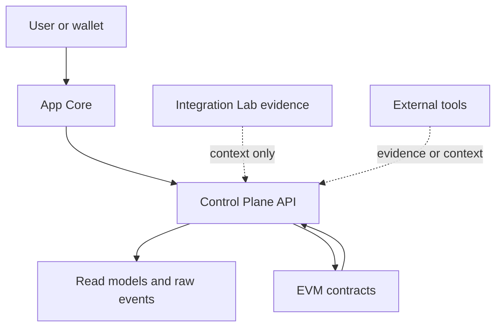

# Authority And Trust

IsoniaOS should make authority visible near the data it affects.

## Authority Boundaries

| Layer | Role | Boundary |
| --- | --- | --- |
| EVM contracts | Model onchain governance state and execution checks. | Authoritative only for state the contracts model. |
| Control Plane | Indexes, stores, projects, explains, and diagnoses. | Read models can lag or fail; they do not create governance authority. |
| SDK | Provides typed API clients and helpers. | It should not invent authority or hide source status. |
| App Core | Presents state and initiates configured wallet transactions. | It should show trust boundaries and error or stale states. |
| Integration Lab | Records provider validation, Sepolia workflows, and evidence fixtures. | Lab records are not product authority. |
| External providers | Own their own records. | Provider records are evidence or context unless explicitly modeled otherwise. |

## Trust Labels

Public UI and APIs should preserve:

- source label;
- trust boundary;
- authority claim;
- verification method;
- import or observation status;
- stale, missing, failed, unknown, or current data status.

Unknown should remain visible as unknown.
