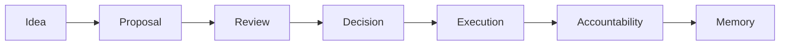

# Governance Lifecycle

IsoniaOS treats governance as a lifecycle rather than a single vote.



## Why It Matters

A vote can say what people approved. It does not always explain what was reviewed, who had authority, what execution was expected, whether execution happened, or what evidence proves the outcome.

The lifecycle model helps governance participants answer:

- What process applied?
- Who approved, vetoed, or executed?
- What action was intended?
- What proof exists?
- What remains unresolved?
- What should future participants learn from this decision?

## Current Product Focus

The current developer-preview focus is the later part of the lifecycle:

```text
decision -> execution -> evidence -> verification -> memory
```

Earlier drafting, discussion, and voting integrations may be linked or previewed, but external tools remain evidence or context unless a source is explicitly modeled as authoritative.
