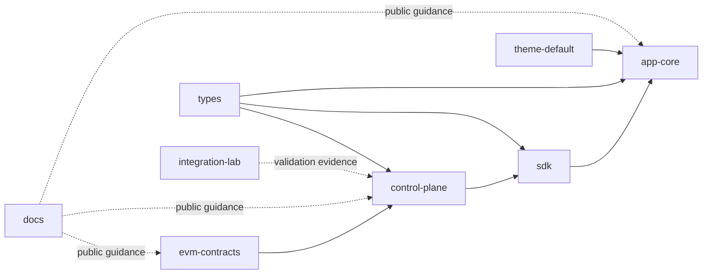

# Repository And System Map

IsoniaOS is developed across focused repositories. Each repository owns one part of the system.

## Core Repositories

| Repository | Public role |
| --- | --- |
| `evm-contracts` | EVM contracts, local deployment scripts, seed tooling, and tests for modeled onchain governance authority. |
| `types` | Dependency-light shared TypeScript DTOs, enums, constants, source disclosure, capabilities, diagnostics, and governance shapes. |
| `control-plane` | NestJS/PostgreSQL/viem indexing, projection, diagnostics, and REST read APIs. |
| `sdk` | Dependency-light typed clients and helpers over Control Plane APIs and shared types. |
| `app-core` | React/Vite self-hostable governance console. |
| `theme-default` | Default replaceable CSS variable theme, typed tokens, brand metadata, and assets. |
| `integration-lab` | Isolated Sepolia, provider, evidence, QA, and presentation-validation material. |
| `docs` | This public documentation site. |

Private ISO token and managed-service planning repositories are not active public product-doc sections.
