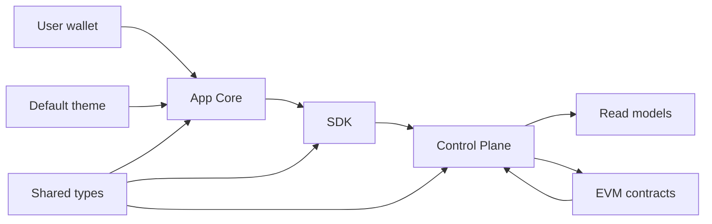

# Technical Overview

This page is the single public developer block for IsoniaOS. It gives the system shape, repository ownership, and configuration boundaries at a high level. Exact commands, variables, scripts, and troubleshooting belong in the owning repository READMEs.

## Architecture

## Repository Ownership

| Repository | Owns | Start here |
| --- | --- | --- |
| `docs` | Public product documentation. | [README](https://github.com/isoniaos/docs/blob/main/README.md) |
| `evm-contracts` | Solidity contracts for modeled organization authority, proposal checks, roles, policy routes, and execution receipts. | [README](https://github.com/isoniaos/evm-contracts/blob/main/README.md) |
| `types` | Shared TypeScript DTOs, enums, constants, events, activation shapes, archive records, accountability records, external resource records, and source-disclosure shapes. | [README](https://github.com/isoniaos/types/blob/main/README.md) |
| `control-plane` | Event ingestion, raw event storage, read models, diagnostics, and REST read APIs. | [README](https://github.com/isoniaos/control-plane/blob/main/README.md) |
| `sdk` | Dependency-light typed Control Plane clients, path helpers, proposal helpers, finalization helpers, and activation helpers. | [README](https://github.com/isoniaos/sdk/blob/main/README.md) |
| `app-core` | React and Vite governance console for reading, explaining, and interacting with configured governance state. | [README](https://github.com/isoniaos/app-core/blob/main/README.md) |
| `theme-default` | Default visual theme values, brand metadata, CSS variables, and assets consumed by App Core. | [README](https://github.com/isoniaos/theme-default/blob/main/README.md) |

## Layer Relationship

- Contracts model onchain organization state where that state is contract-backed.
- Control Plane indexes and explains state; it does not create governance authority.
- Shared types keep cross-repository data shapes aligned.
- SDK gives typed clients and helpers without UI or chain ownership.
- App Core presents state, shows data freshness, and starts configured wallet interactions.
- Theme Default changes presentation without changing governance behavior.

## Configuration Boundaries

Configuration should describe how a runtime reads state and connects components. It should not quietly create authority.

Important categories are:

- chain ID and RPC endpoint;
- deployed contract addresses;
- Control Plane API, database, indexing, and CORS settings;
- App Core API base URL, deployment-array chain metadata, feature flags, Reown-derived wallet mode, metadata settings, and theme source;
- SDK consumer base URL;
- theme package consumption.

Use repository READMEs for exact field names. Do not infer product capability from package versions. Capability claims should come from configured deployment data, observable contract state, API support, and documented product behavior.

## Maturity Limits

The public repositories are in active developer-preview work. Developers should expect cross-repository coordination when changing contracts, shared data shapes, Control Plane APIs, SDK helpers, or App Core user flows.

Public documentation should stay conservative: contract state, read models, UI state, manual notes, and external records have different trust boundaries, and those boundaries should remain visible to users.
