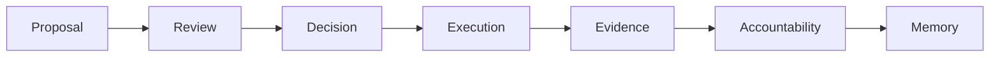

# IsoniaOS

IsoniaOS is a governance control plane for accountable digital organizations.

It helps a community understand what happened to a decision after it was proposed, reviewed, approved, executed, checked, and remembered.

## Who It Is For

IsoniaOS is for DAO contributors, organization admins, council members, working groups, community reviewers, evaluators, design partners, and technical developers who need one understandable record of governance follow-through.

## The Problem It Solves

Many organizations can approve a proposal but still lose track of what happened next. Discussion may live in one place, approval in another, execution somewhere else, and follow-up notes in a document no one can find later.

IsoniaOS gives the organization a shared way to ask:

- What was proposed?
- Who reviewed it?
- What was decided?
- What action was expected?
- What evidence shows what happened?
- Who is responsible for follow-up?
- What should future participants remember?

## What You Can Do

With the current product model, an organization can describe its governance structure, use templates for repeatable processes, create proposal records, connect decisions to execution evidence, track responsible people and due dates, and build a public memory of past decisions.

Some of those flows are current developer-preview work and some are planned for public beta. Pages in this site call out limits where the current implementation is partial or not yet validated end to end.

## Current Maturity

IsoniaOS is in developer-preview development. The project is production-shaped, but these docs do not claim production operation, audit completion, public beta completion, legal completeness, external integration completeness, or security completeness.

Use this site to understand the product and the current public model. Use repository READMEs from the [developer overview](developers/index.md) only when you need exact technical setup details.

## Where To Start

- Read the [whitepaper](whitepaper.md) for the long-form product model.
- Read [Learn](learn/index.md) for the core concepts in plain English.
- Read the [User Guide](user-guide/index.md) for user-facing workflows.
- Read the [Roadmap](roadmap.md) to see what is done, planned, and still uncertain.
- Read the [Developer overview](developers/index.md) if you need implementation boundaries and repository links.
