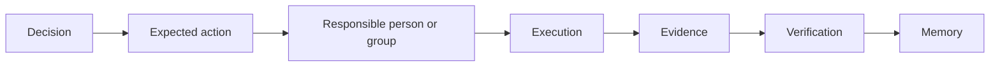

# Decisions, Execution, And Evidence

A decision is the result of a governance process. Execution is what happens after that decision. Evidence is the record that supports what happened.

## The Follow-Through Chain

## Decision

A decision may be approved, rejected, cancelled, expired, executed, or blocked depending on the configured process.

A useful decision record should show:

- proposal title and purpose;
- route or process used;
- review status;
- outcome;
- responsible person or group;
- expected action;
- due date or expected window;
- required evidence.

## Execution

Execution can mean different things:

- a configured transaction is sent;
- an external proof is published;
- a contributor completes a milestone;
- a working group begins a mandate;
- the record states that no action is needed.

Execution should not be hidden in private coordination. If the organization approves an action, the record should show what happened next.

## Evidence

Evidence supports a specific claim. It can include:

- transaction hash;
- external public record;
- document link;
- milestone proof;
- reviewer note;
- completion confirmation.

Evidence should be tied to a clear claim. "A link exists" is not the same as "the approved work was completed."

## Verification

Verification asks whether the evidence supports the claim.

| Claim | What to check |
| --- | --- |
| A contract-backed action executed | Contract event and transaction receipt. |
| A payment or call happened | Transaction details. |
| A contributor delivered work | Linked deliverable and reviewer confirmation. |
| A record is unresolved | Current accountability status and note. |
| Data may be stale | Diagnostics and freshness status. |

## Example

Community Grants DAO approves a proposal to fund a contributor. The expected action is recorded. The responsible executor attaches the transaction hash or external proof. A reviewer confirms whether the evidence matches the approved scope.
