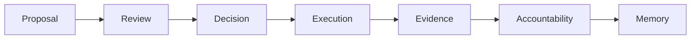

# Governance Lifecycle

IsoniaOS is built around one idea:

```text
Governance is not a vote. Governance is a lifecycle.
```



## What Each Step Means

| Step | Meaning |
| --- | --- |
| Proposal | Someone asks the organization to decide something. |
| Review | The organization checks context, risks, budget, permissions, and expected evidence. |
| Decision | The configured process produces an outcome. |
| Execution | The expected action happens, or the record shows why it did not. |
| Evidence | A transaction, external record, document, milestone proof, or note supports the claim. |
| Accountability | A responsible person or group owns follow-up until the record is complete, cancelled, failed, or blocked. |
| Memory | The resolved record helps future participants understand what happened. |

## Why This Matters

A vote can show what people approved. It does not always show what was reviewed, who had authority, whether the approved action happened, or what evidence proves the outcome.

The lifecycle helps a participant answer:

- What was proposed?
- Who reviewed it?
- What route or permission applied?
- What action was expected?
- Who owns the next step?
- What proof exists?
- What is still unresolved?

## Current Product Focus

Current developer-preview work focuses on the later part of the lifecycle:

```text
decision -> execution -> evidence -> accountability -> memory
```

Earlier drafting, discussion, and external voting records can be linked or imported as evidence where supported, but external records do not automatically become IsoniaOS authority.
