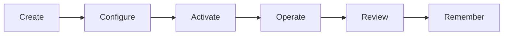

# Organizations

An organization is the group using IsoniaOS to structure governance records.

It may be a DAO, grants program, council, working group, public-good community, association, or other digital organization.

## What An Organization Contains

An IsoniaOS organization can include:

- name and purpose;
- roles and permissions;
- templates;
- proposal routes;
- active and historical proposals;
- decisions;
- execution evidence;
- accountability records;
- governance memory.

## Organization Lifecycle

| Stage | Plain-language meaning |
| --- | --- |
| Create | Start an organization record. |
| Configure | Choose roles, permissions, and templates. |
| Activate | Complete the required settings for the chosen governance flow. |
| Operate | Use proposals, decisions, evidence, and accountability. |
| Review | Check what is blocked, late, failed, cancelled, or complete. |
| Remember | Preserve the final record for future participants. |

## Activation

Activation means the organization is no longer only a draft. Required settings are complete enough for the configured flow to be used.

Activation does not mean every future feature is complete. It means the current organization setup has passed the required checks for the selected model.

In contract-backed flows, activation should be tied to modeled contract state. In manual or external-record flows, IsoniaOS should show that the record is evidence or an annotation.

## Example

Community Grants DAO creates an organization named "Community Grants DAO" with a short purpose: fund contributor work transparently.

Before activation, the admin chooses a template, confirms reviewers, sets who can approve proposals, and defines what evidence a completed grant should include.
