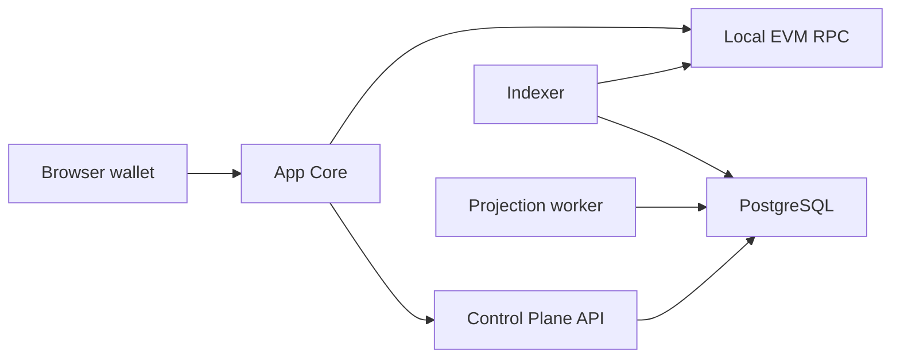

# Local Runtime

The local runtime is a set of coordinated services, not a single packaged deployment.

## Runtime Components

| Component | Source |
| --- | --- |
| Local EVM node and deployed contracts | [`evm-contracts`](https://github.com/isoniaos/evm-contracts/blob/main/README.md) |
| PostgreSQL schema and read models | [`control-plane`](https://github.com/isoniaos/control-plane/blob/main/README.md) |
| API and diagnostics | [`control-plane`](https://github.com/isoniaos/control-plane/blob/main/README.md) |
| Frontend runtime config | [`app-core`](https://github.com/isoniaos/app-core/blob/main/README.md) |
| Evidence and provider validation | [`integration-lab`](https://github.com/isoniaos/integration-lab/blob/main/README.md) |

## Operational Boundary

Lab manifests and testnet evidence can help validate behavior, but they should not be imported as production runtime configuration. Public docs should point to repository-local commands rather than copy long command sequences.
