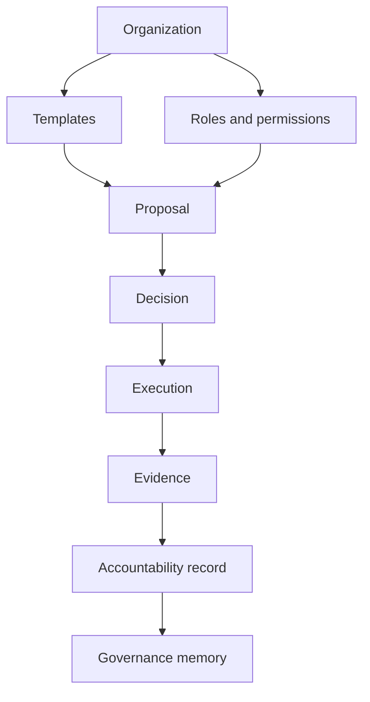
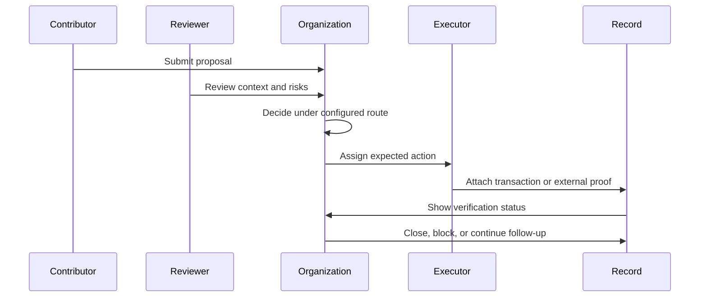
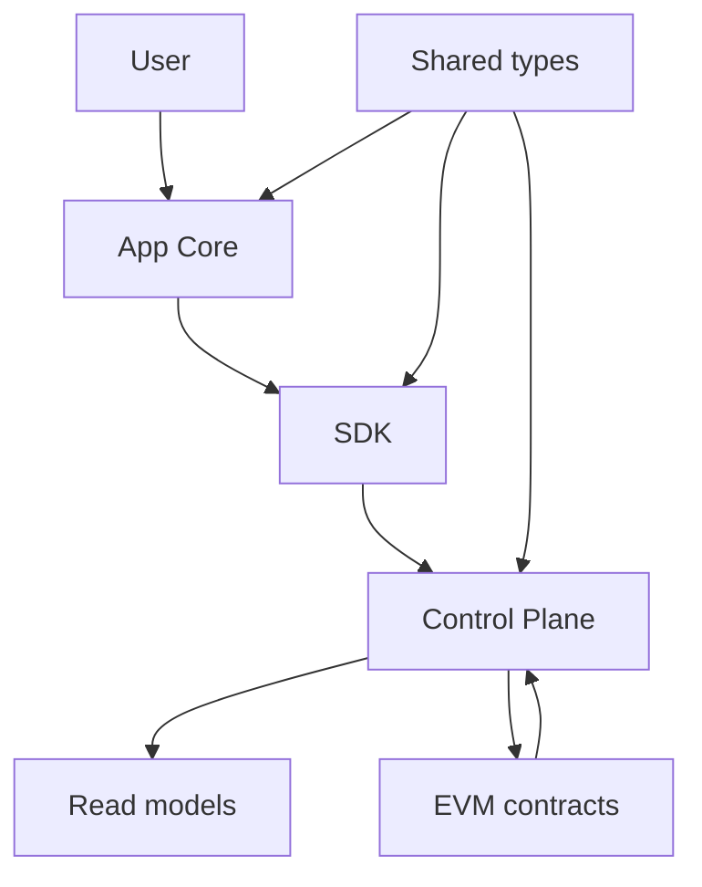

# IsoniaOS Whitepaper

## 1. Abstract

IsoniaOS is a governance control plane for accountable digital organizations.

It starts from a practical problem: communities often know that a proposal passed, but they cannot easily show what was reviewed, who became responsible, what action followed, what evidence proves the outcome, and what future participants should remember.

IsoniaOS treats governance as a lifecycle:

```text
Proposal -> Review -> Decision -> Execution -> Evidence -> Accountability -> Memory
```

The first public focus is DAO governance because the pain is concrete. DAOs manage proposals, roles, approvals, shared budgets, contributor work, grants, external records, and onchain actions across many tools. IsoniaOS does not try to replace every tool. It helps the organization connect the records and keep authority boundaries clear.

## 2. The Problem: Governance Decisions Become Fragmented Records

Modern digital organizations use many places to make and record decisions:

- forum posts and documents for context;
- community calls and chat for discussion;
- voting or approval tools for decisions;
- wallets and contract systems for execution;
- block explorers and external links for proof;
- spreadsheets or project boards for follow-up.

Each place can be useful. The problem is that the full story becomes hard to reconstruct.

A community member may see that a proposal was approved and still not know:

- what problem the proposal tried to solve;
- which review process applied;
- who had permission to approve, veto, or execute;
- what action was expected after approval;
- who became responsible for follow-through;
- whether the action happened;
- what evidence supports the outcome;
- whether the work is blocked, late, failed, or complete;
- where future contributors should look for the decision history.

This creates an execution gap. The organization makes a decision, but the follow-through becomes private, scattered, or unclear.

## 3. Why This Matters For Digital Organizations

Governance is not only the moment of voting or approval. Good governance needs context before a decision, clear authority during the decision, and visible accountability after the decision.

Without that lifecycle:

- contributors repeat old debates because the record is hard to find;
- admins must answer the same status questions again and again;
- approved work can drift away from what was actually authorized;
- grants and contributor scopes can lose clear ownership;
- reviewers cannot tell whether a proposal was executed as intended;
- new participants struggle to understand how the organization really works.

IsoniaOS is designed to make those records easier to follow without pretending that one interface is the whole source of truth.

## 4. IsoniaOS Vision

The vision is accountable governance for digital organizations.

IsoniaOS should help a DAO, grants program, council, foundation, public-good community, association, or working group answer five questions quickly:

1. What was decided?
2. Who had authority?
3. What action was expected?
4. What evidence exists?
5. What remains unresolved?

The product direction is summarized by two statements:

```text
Governance is not a vote. Governance is a lifecycle.
```

```text
From proposal to proof of execution.
```

## 5. Core Product Model

IsoniaOS organizes governance around a few durable objects:

| Object | Plain-language meaning |
| --- | --- |
| Organization | The DAO, working group, grants program, council, or community using IsoniaOS. |
| Role | A named responsibility, such as admin, reviewer, executor, contributor, or observer. |
| Permission | A rule for who can do something. |
| Template | A reusable setup pattern for common governance processes. |
| Proposal | A request for the organization to decide something. |
| Decision | The outcome of a proposal or approval process. |
| Execution | The action expected after a decision. |
| Evidence | A record that supports a claim about what happened. |
| Accountability record | The follow-up record showing owner, status, due date, evidence, and review outcome. |
| Governance memory | The durable history that future participants can inspect. |

The product model is not only about creating records. It is about showing relationships between records.



## 6. Organization Lifecycle

An organization should move through a simple lifecycle.

| Stage | What it means |
| --- | --- |
| Create | A new organization record is started with a name, purpose, and admin context. |
| Configure | The organization chooses roles, permissions, and a template. |
| Activate | Required settings are complete enough for the configured governance process to be used. |
| Operate | Participants create proposals, review them, make decisions, execute approved work, and attach evidence. |
| Review | The organization checks follow-through, delays, failures, and completion notes. |
| Remember | Resolved decisions become part of the governance memory. |

Activation matters because a half-configured organization can be misleading. IsoniaOS should make it clear whether the organization is still being set up, active for the configured flow, paused, or limited by missing data.

In contract-backed flows, activation and authority should be tied to modeled contract state. In manual or external-record flows, IsoniaOS should show that those records are annotations or evidence unless a documented model says otherwise.

## 7. Roles And Permissions, Explained In Plain Language

Roles help people understand responsibility. Permissions define what those roles can do.

An early organization may use simple roles:

- Admin: configures the organization and core settings.
- Reviewer: checks proposals before a decision.
- Approver: can approve a proposal under the configured route.
- Executor: can perform or confirm an approved action.
- Contributor: submits proposals or completes assigned work.
- Observer: can read public records without changing them.

A permission should answer a narrow question:

- Who can create a proposal?
- Who can review it?
- Who can approve it?
- Who can veto or block it, if the process allows that?
- Who can execute the approved action?
- Who can attach evidence?
- Who can mark follow-up complete?

Good role design should avoid hidden power. A participant should be able to see why a person or group can perform an action.

## 8. Templates And Repeatable Governance Patterns

Templates help organizations avoid starting from a blank page.

A template can define:

- default roles;
- review steps;
- required fields for proposals;
- approval route;
- evidence requirements;
- accountability fields;
- common statuses;
- archive structure.

For example, a Community Grants DAO might choose a simple grants template:

1. Contributor submits a funding proposal.
2. Reviewers check scope, budget, and expected evidence.
3. Approvers decide whether the proposal should pass.
4. A responsible person is assigned.
5. Evidence is attached when the work is completed.
6. The final record shows outcome, proof, and any unresolved issues.

Templates should be editable over time. A template is a starting pattern, not a guarantee that every organization has the same process.

## 9. Proposals, Decisions, Execution, Evidence, Verification, And Memory

The core IsoniaOS loop connects a decision to follow-through.



Evidence can come from different places. It may be a transaction, an external public record, a document, a milestone note, or a manual completion update.

Verification asks a more precise question: what claim does this evidence support?

| Claim | Better evidence |
| --- | --- |
| A contract-backed action executed | Contract event and transaction receipt. |
| A payment or call happened | Chain transaction and visible recipient/action details. |
| A contributor completed work | Linked deliverable plus reviewer confirmation. |
| A decision is still unresolved | Accountability status, due date, and current note. |
| A public record was imported | External URL, source name, import time, and freshness status. |

Governance memory is the result. It is the durable record that helps future participants understand why a decision happened and whether follow-through matched the approved intent.

## 10. Accountability Model

An approved proposal creates a follow-up question, not only a result.

IsoniaOS accountability records should help users see:

- responsible person or group;
- due date or expected window;
- current status;
- evidence links;
- milestone notes;
- failure or cancellation reason;
- reviewer or confirming party;
- completion note;
- history of updates.

Useful statuses include:

- not needed;
- waiting for execution;
- in progress;
- blocked;
- executed;
- complete;
- failed;
- cancelled;
- unknown.

Manual updates are useful, but they should be shown as manual updates. A completion note does not automatically prove that the approved intent was satisfied. The product should preserve the difference between "someone said it is done" and "the evidence supports the claim."

## 11. Trust And Authority Boundaries

IsoniaOS should make trust boundaries visible.

Contracts can be authoritative for the onchain state they model. Control Plane read models can make that state easier to read, but read models can lag or fail. App Core can present state and start configured wallet interactions, but the interface itself is not the final authority. External records can provide evidence or context, but they do not override contract-backed state unless a specific product model says so.

| Source | What it can do | Boundary |
| --- | --- | --- |
| Contract-backed state | Prove modeled onchain facts. | Only covers the facts the contracts model. |
| Control Plane | Index, project, diagnose, and expose read APIs. | Can be stale, missing, or failed. |
| App Core | Help users view state and initiate configured actions. | Should not hide authority or freshness limits. |
| External record | Provide evidence or context. | Does not override IsoniaOS authority by default. |
| Manual note | Explain status, reasons, or follow-up. | Is an annotation unless verified another way. |

Clear wording matters. A good public record should say things like:

```text
This record is linked evidence. It does not override contract state.
```

## 12. User Experience Model

The user experience should be organized around questions people actually ask.

For a community member:

- What is this organization?
- Which proposals are active?
- What was approved?
- What happened after approval?
- What evidence can I inspect?
- Who owns the next step?

For an admin:

- Is the organization configured?
- Which template is being used?
- Which roles and permissions are active?
- Which proposals need review?
- Which follow-up records are blocked or late?
- Which data is stale, missing, or unknown?

For a technical developer:

- Which layer owns this data?
- Which repository owns the implementation?
- Which source has authority for this field?
- Which read model or API surface is involved?

The same product can serve all three groups if it keeps the main record plain and routes technical details to the developer page.

## 13. Technical Architecture Overview

IsoniaOS is split into focused public components:

- EVM contracts model contract-backed organization authority, roles, policy routes, proposal checks, and execution receipts.
- Control Plane indexes events, stores raw records, builds read models, exposes diagnostics, and provides REST read APIs.
- Shared types define common data shapes used across services and frontends.
- SDK provides typed clients and helpers for Control Plane consumers.
- App Core is the governance console used to view organizations, proposals, accountability, evidence, diagnostics, and configured wallet interactions.
- Theme Default provides default presentation assets and theme values.
- Docs explain product concepts, user flows, technical boundaries, and public roadmap direction.

This architecture is intentionally layered:



The technical model should preserve authority rather than blur it. A read API can explain contract state. It should not silently become the authority for contract-backed facts.

## 14. Privacy, Safety, And Limitations

IsoniaOS records governance information. That information can affect people, budgets, reputations, and community decisions.

Public records should avoid secrets, private keys, private endpoints, private customer data, and misleading claims. Evidence should be linked only when the organization is comfortable making the record public or has a clear policy for restricted access.

Current limitations:

- IsoniaOS is in developer-preview work.
- Some user flows are planned or partial.
- Exact behavior can differ by repository and current branch.
- Read models can lag the source they represent.
- External records can be stale, missing, or wrong.
- Manual notes are useful, but they are not automatic proof.
- Production operation, audit completion, public beta completion, and security completeness are not claimed by these docs.

These limitations are not a reason to hide information. They are a reason to show status clearly.

## 15. Roadmap Relationship

The roadmap is directional. It explains how the product grows from early lifecycle modeling into public beta and later broader organization workflows.

Near-term work focuses on the proposal-to-proof loop: organization setup, activation, roles, templates, proposals, execution evidence, accountability records, diagnostics, and better user flows.

Later work can expand templates, integrations, accessibility, organization-scale usage, contributor accountability, dispute records, and broader digital-organization use cases.

The roadmap is not a promise that a feature is complete. It uses checkboxes to separate current evidence from planned work.

## 16. Glossary And Key Terms

For short definitions, see the [Glossary](reference/glossary.md).

Key terms:

- governance lifecycle;
- organization;
- activation;
- role;
- permission;
- template;
- proposal;
- decision;
- execution;
- evidence;
- verification;
- accountability;
- governance memory;
- authority boundary.
