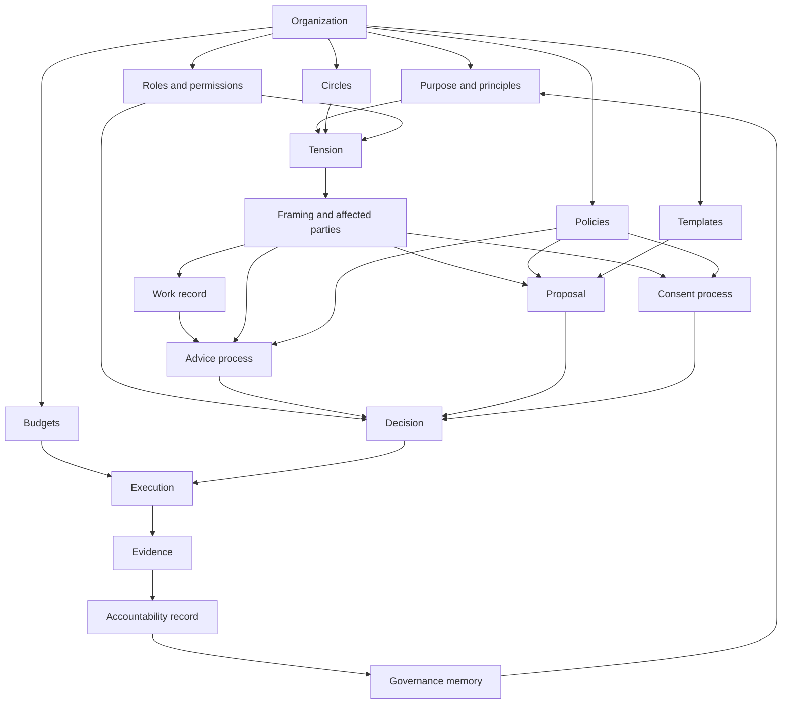
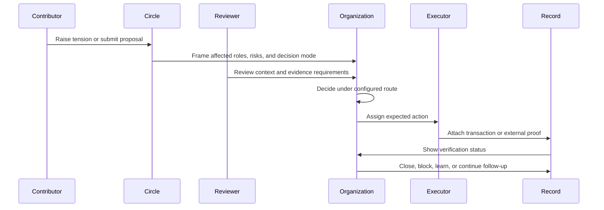
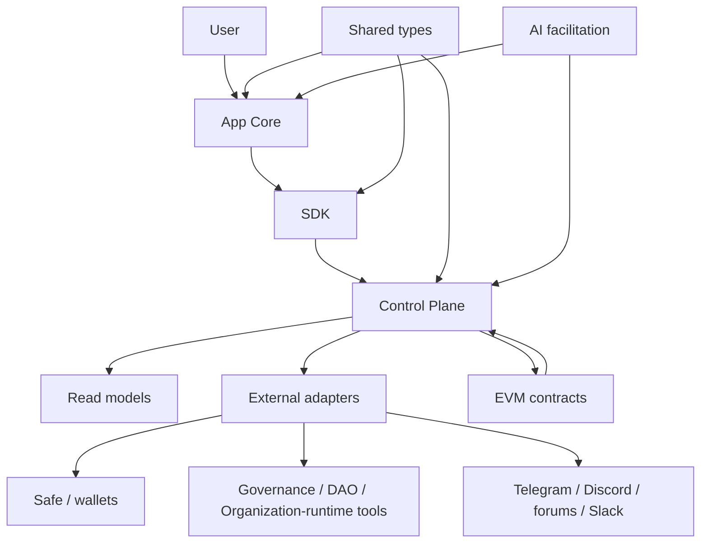

# IsoniaOS Technical Whitepaper

**Version:** 0.1.0<br>
**Date:** 2026-05-29<br>
**Status:** Technical strategic baseline<br>
**Audience:** governance researchers, DAO operators, protocol teams, engineers, contributors, public-good communities, and design partners

This document is directional. It should not be read as a production, audit, legal, provider-completeness, token-launch, public-beta, AI-safety-completeness, or security-completeness claim.

## 1. Abstract

IsoniaOS is a governance control plane and self-management operating layer for accountable digital organizations.

It starts from a practical problem: communities often know that a proposal passed, but they cannot easily show what was reviewed, who became responsible, what action followed, what evidence proves the outcome, and what future participants should remember.

IsoniaOS treats governance as a lifecycle:

```text
Tension -> Framing
-> Proposal or Advice Process
-> Decision
-> Execution
-> Evidence
-> Accountability
-> Memory
```

The first public focus is DAO governance because the pain is concrete. DAOs manage proposals, roles, approvals, shared budgets, contributor work, grants, external records, onchain actions, and community discussion across many tools. IsoniaOS does not try to replace every tool. It helps the organization connect the records, keep authority boundaries clear, and make distributed work accountable.

The long-term direction is broader than voting. IsoniaOS aims to help DAOs, foundations, cooperatives, public-good communities, open-source projects, protocol teams, civic groups, and other digital organizations move toward accountable self-management: roles instead of hidden hierarchy, policies instead of opaque authority, evidence instead of trust-me claims, and AI-assisted coordination without centralized control.


## 2. Intellectual Lineage And Design Commitments

IsoniaOS belongs to a long conversation about how humans coordinate without hiding power. It does not treat decentralization as a slogan, self-management as an HR style, or blockchain as an automatic cure for governance problems. The project starts from a stricter claim: authority must be visible, decisions must be traceable, execution must be evidenced, and collective memory must survive tool fragmentation.

Several intellectual traditions shape this view.

> "There is no such thing as a structureless group." — Jo Freeman, [The Tyranny of Structurelessness](https://www.jofreeman.com/joreen/tyranny.htm)

Freeman's critique of structurelessness is essential for digital organizations. A DAO, protocol community, open-source collective, cooperative, or civic group can reject formal hierarchy and still reproduce informal power. The design lesson for IsoniaOS is simple: if authority exists, the system should help make it explicit, reviewable, and accountable.

> "Code is law." — Lawrence Lessig, [Code: Version 2.0](https://lessig.org/product/codev2/)

Lessig's point is not that software should replace law or politics. It is that architecture regulates behavior. In blockchain systems this becomes concrete: contracts, wallets, roles, interfaces, indexers, and permissions shape what participants can do. IsoniaOS therefore treats technical architecture as governance architecture.

> "There are no panaceas." — Elinor Ostrom, [A Diagnostic Approach for Going Beyond Panaceas](https://doi.org/10.1073/pnas.0702288104)

Ostrom's work on commons governance warns against universal templates. Communities can self-govern shared resources, but durable governance depends on local rules, monitoring, conflict-resolution mechanisms, and the ability of affected people to participate in changing rules ([Governing the Commons](https://www.cambridge.org/core/books/governing-the-commons/7AB7AE11BADA84409C34815CC288CD79)). IsoniaOS should therefore support templates without pretending that one governance model fits all organizations.

> "The distinguishing mark of the firm is the supersession of the price mechanism." — Ronald Coase, [The Nature of the Firm](https://doi.org/10.1111/j.1468-0335.1937.tb00002.x)

Coase explained why firms exist when markets are too costly for coordination. Digital organizations create a new question: if software, networks, smart contracts, and AI reduce some coordination costs, which parts of the firm can become transparent, modular, and self-managed rather than hierarchical? IsoniaOS exists in that question.

Modern organization design adds another layer. Teal management, Holacracy, Sociocracy, and related self-management systems show that roles, circles, tensions, consent, advice, and evolutionary purpose can replace parts of the command hierarchy when the surrounding operating system is mature. Useful references include Frederic Laloux's [Reinventing Organizations](https://www.reinventingorganizations.com/), Brian Robertson's *Holacracy*, and [Sociocracy 3.0](https://sociocracy30.org/). Web3 and DAO research add primitives for programmable execution, treasury coordination, delegation, reputation, sybil resistance, and digital constitutionalism. Useful references include Vitalik Buterin's [DAOs are not corporations](https://vitalik.ca/general/2022/09/20/daos.html), Ohlhaver, Weyl, and Buterin's [Decentralized Society](https://ssrn.com/abstract=4105763), and [The Constitutions of Web3](https://arxiv.org/abs/2403.00081).

IsoniaOS does not copy any one tradition. It translates the strongest lessons into a governance control plane:

- structure must be visible enough to prevent hidden hierarchy;
- code must expose authority instead of disguising it;
- no governance template should claim universal validity;
- self-management requires roles, policies, evidence, and accountability;
- DAOs need more than votes;
- AI can help memory and coordination, but it must not become the ruler.

This is the philosophical center of IsoniaOS: accountable self-management for organizations that want to distribute authority without losing responsibility.

## 3. The Problem: Governance Decisions Become Fragmented Records

Modern digital organizations use many places to make and record decisions:

- forum posts and documents for context;
- Telegram, Discord, Slack, and community chat for discussion;
- calls, meeting notes, and community updates for informal alignment;
- governance, DAO framework, treasury, work-management, delegation, or organization-runtime tools for proposals, voting, delegation, work, payments, or community operations;
- Safe and other wallet systems for execution;
- block explorers and external links for proof;
- spreadsheets, issue trackers, or project boards for follow-up.

Each place can be useful. The problem is that the full story becomes hard to reconstruct.

A community member may see that a proposal was approved and still not know:

- what problem or tension the proposal tried to resolve;
- which discussion shaped the decision;
- which review process applied;
- who had permission to approve, veto, advise, or execute;
- which people or roles were affected;
- what action was expected after approval;
- who became responsible for follow-through;
- whether the action happened;
- what evidence supports the outcome;
- whether the work is blocked, late, failed, or complete;
- where future contributors should look for the decision history.

This creates an execution gap. The organization makes a decision, but the follow-through becomes private, scattered, or unclear.

It also creates a self-management gap. People may be told that the organization is decentralized or community-led, but the actual authority can remain hidden in private chats, multisigs, informal founder decisions, contributor cliques, or untracked operational habits. IsoniaOS is designed to make those authority paths visible without pretending that one interface is the whole source of truth.

## 4. Why This Matters For Digital Organizations

Governance is not only the moment of voting or approval. Good governance needs context before a decision, clear authority during the decision, and visible accountability after the decision.

Without that lifecycle:

- contributors repeat old debates because the record is hard to find;
- admins must answer the same status questions again and again;
- approved work can drift away from what was actually authorized;
- grants and contributor scopes can lose clear ownership;
- reviewers cannot tell whether a proposal was executed as intended;
- delegated power can be exercised without enough visibility;
- decisions can be forced into votes even when a role decision or advice process would be healthier;
- informal leadership can become more powerful than the documented governance model;
- new participants struggle to understand how the organization really works.

IsoniaOS is designed to make governance records easier to follow, but the deeper purpose is to help organizations operate without depending on opaque hierarchy.

A self-managed organization does not mean an organization without power. It means power is distributed through visible roles, policies, decision modes, evidence, accountability, and review.

## 5. IsoniaOS Vision

The vision is accountable self-management for digital organizations.

IsoniaOS should help a DAO, grants program, council, foundation, public-good community, cooperative, association, open-source project, protocol team, or working group answer eight questions quickly:

1. What tension, need, or opportunity started this work?
2. What was decided?
3. Who had authority?
4. Which role, circle, policy, or vote created that authority?
5. What action was expected?
6. What evidence exists?
7. Who is accountable now?
8. What remains unresolved?

The product direction is summarized by three statements:

```text
Governance is not a vote. Governance is a lifecycle.
```

```text
From proposal to proof of execution.
```

```text
From hierarchy and hidden coordination to accountable self-management.
```

IsoniaOS should become the memory, accountability, and coordination layer for organizations that want to distribute authority without losing responsibility.

## 6. Accountable Self-Management And Teal Governance

The term “teal governance” is used here as a practical shorthand for mature self-management. In this context, it does not mean vague horizontality or the absence of leadership. It means an organization where:

- authority is distributed through roles, circles, policies, and explicit decision modes;
- people can act without asking a central manager for every decision;
- important decisions are still traceable, reviewable, and accountable;
- the organization is guided by a clear purpose, not only by short-term voting outcomes;
- governance evolves through tensions, feedback, and evidence;
- AI can assist coordination, but it does not become the source of authority.

IsoniaOS can express teal governance in a public, technical, and auditable way.

Instead of reducing governance to this loop:

```text
Proposal -> Vote -> Result
```

IsoniaOS should support a richer loop:

```text
Purpose -> Tension -> Framing
-> Advice or Proposal
-> Decision
-> Execution
-> Evidence
-> Accountability
-> Learning
-> Updated Purpose, Role, Policy, or Template
```

This model matters because many DAO systems solve the voting problem but not the organization problem. Real organizations need roles, budgets, working groups, operational policies, conflict handling, execution tracking, and memory.

IsoniaOS should not present self-management as an unverified maturity claim. It should show which parts are modeled, which parts are manual, which parts come from external systems, and which parts are planned.


## 7. Design Lessons From Mature Organization-Runtime Systems

IsoniaOS should learn from the strongest organization-runtime products, DAO frameworks, treasury tools, and governance protocols in the industry without becoming a clone of any single system. The lesson is not that every organization should migrate into one product. The lesson is that serious digital organizations need operational primitives, not only a voting page.

The best systems in this category treat an internet organization as an operating environment: scoped teams or domains structure work, permissions constrain authority, budgets and expenditures allocate resources, work records connect labor to payment, objections and disputes provide an escalation path, and reputation-like signals attempt to make influence contextual. IsoniaOS should absorb these patterns as product lessons while remaining a neutral control plane across many systems.

### 7.1 Day-to-day work should not be held hostage by voting

A self-managed organization cannot vote on every action. Voting is slow, expensive in attention, and often the wrong tool for routine work. IsoniaOS should therefore make the ordinary path permissive where policy allows it, and reserve votes for high-impact, disputed, or constitutionally important decisions.

This leads to a practical rule:

```text
Default to action within a visible role or policy.
Escalate to advice, consent, vote, multisig, or dispute only when the risk requires it.
```

The product should help users see why a decision did not require a vote just as clearly as it shows why another decision did require one.

### 7.2 Circles and domains make authority contextual

Large organizations become illegible without structure. Some mature organization systems use domains or teams to group work, budgets, and authority. IsoniaOS should use circles in a similar organizational role: circles are not departments in a rigid hierarchy; they are scoped domains of responsibility.

A circle should be able to hold:

- a purpose;
- roles;
- policies;
- budgets;
- tensions;
- decision-mode rules;
- accountability records;
- external-source links;
- review history.

This keeps decisions close to people with relevant context while still preserving escalation paths to broader organization authority when needed.

### 7.3 Budgets, payments, and work records are governance

Money movement is not separate from governance. A payment expresses an authorized judgment: that some work, service, grant, salary, bounty, or reimbursement should receive resources from a shared treasury.

IsoniaOS should therefore treat budgets and payments as governance records with expected context:

- which circle or policy authorized the spend;
- which decision mode applied;
- who requested it;
- who reviewed it;
- who executed it;
- which wallet, transaction, or external system moved funds;
- what work, deliverable, milestone, or obligation the payment relates to;
- what evidence confirms completion or explains failure.

This is where IsoniaOS can differentiate from pure voting tools. It should connect financial execution to organizational intent and accountability.

### 7.4 Reputation is a contextual signal, not a universal rank

Reputation can help route authority, but it is dangerous when treated as a single universal score. A contributor can be highly trusted in Solidity security, moderately trusted in protocol operations, and unknown in community moderation.

IsoniaOS should model reputation-like data as contextual contribution signals:

- scoped to organization, circle, skill, role, or workstream;
- derived from visible evidence where possible;
- source-disclosed when imported from external systems;
- reviewable by humans;
- separated from legal identity and private personal data;
- never presented as a complete measure of a person.

The goal is not a social-credit system. The goal is to help the organization ask: who has relevant demonstrated context for this decision?

### 7.5 The core should stay small; extensions and adapters carry diversity

Organization design is too diverse for one hardcoded workflow. IsoniaOS should keep the authority model and record model stable while allowing external systems, templates, and adapters to express different governance mechanisms.

The core should provide:

- organization identity;
- roles and permissions;
- policies;
- decision records;
- evidence records;
- accountability records;
- trust-boundary metadata;
- adapter maturity labels.

Extensions and adapters can then provide specialized behavior for Safe execution, Snapshot signaling, Governor proposals, delegation, forums, work records, payments, disputes, discussion ingestion, or AI summaries.

### 7.6 Maturity should be gradual

A new organization may need human moderators, admins, or stewards. A mature organization may automate more decisions through policies, adapters, extensions, or contract-backed routes. IsoniaOS should not shame early organizations for being partially centralized. It should make the centralization visible and help the organization evolve deliberately.

A healthy maturity path can look like this:

```text
Manual records -> role-based authority -> policy-constrained decisions -> adapter-backed evidence -> contract-backed execution -> automated checks and dispute paths
```

The product should show which stage a process is in rather than pretending every organization is fully decentralized.

### 7.7 Consensus should be visible; dissent should have a path

The system should not block action when there is clear consensus, but it must provide a path when there is dissent. IsoniaOS should support objections, escalations, disputes, appeals, and post-action reviews as first-class records.

A decision that proceeds without objection should still leave a clear trace. A decision that faces objection should show what was objected to, who was affected, which policy applied, what evidence was reviewed, and how the issue was resolved.

### 7.8 Integrate proven organization runtimes instead of cloning them

Some of the strongest governance products in the industry already prove that digital organizations need more than proposals and votes. They combine scoped teams, permissions, budgets, work records, contribution signals, execution paths, objections, disputes, and extension mechanisms into an operational environment.

IsoniaOS should treat these as proven industry patterns, not as a mandate to recreate a closed organization runtime. The goal is to make IsoniaOS the neutral accountability, memory, and coordination layer that can sit beside many organization systems and explain how their records relate to authority, evidence, and follow-through.

When an organization already uses an organization-runtime product, IsoniaOS should be able to index or link its records as external authority, discussion, execution, or evidence sources where technically, legally, and operationally appropriate.

A read-only organization-runtime adapter could map:

| External organization-runtime record | IsoniaOS interpretation |
| --- | --- |
| Organization record | Organization or external organization source |
| Team, domain, department, or workstream | Circle or external circle evidence |
| Permission or role assignment | Role, permission, or authority evidence |
| Motion, action request, or operational proposal | Proposal, decision, objection, or dispute record |
| Expenditure, grant, payroll item, or payment | Execution and evidence record |
| Task, bounty, milestone, or work item | Work record and accountability record |
| Reputation, contribution, or trust signal | Contextual contribution signal |
| Objection, dispute, appeal, or arbitration event | Dispute, escalation, and review record |
| Extension or plugin action | External adapter event with explicit trust boundaries |

The first integration scope should be read-only. Write integration should wait for legal, licensing, security, authority, and UX evidence gates.

## 8. Core Product Model

IsoniaOS organizes governance and self-management around durable objects:

| Object | Plain-language meaning |
| --- | --- |
| Organization | The DAO, working group, grants program, council, cooperative, protocol team, or community using IsoniaOS. |
| Purpose | The organization’s reason for existing, operating principles, and high-level direction. |
| Circle | A semi-autonomous working group around a purpose, domain, budget, or function. |
| Budget | A scoped allocation of shared resources tied to an organization, circle, policy, proposal, or workstream. |
| Role | A named responsibility, such as admin, reviewer, executor, treasury steward, grant reviewer, security reviewer, contributor, delegate, or observer. |
| Permission | A rule for who can do something. |
| Policy | A documented rule that defines authority, process, limits, thresholds, or review requirements. |
| Template | A reusable setup pattern for common governance and self-management processes. |
| Tension | A visible gap between the current state and a better state: problem, risk, need, opportunity, ambiguity, or conflict. |
| Work record | A task, grant, bounty, deliverable, salary, milestone, or contribution record connected to responsibility and evidence. |
| Contribution signal | A contextual record of demonstrated work, review, delivery, participation, or trust imported or computed with source disclosure. |
| Proposal | A request for the organization to decide something. |
| Advice process | A decision mode where a role-holder can decide after consulting affected people and relevant experts. |
| Consent process | A decision mode where a change can proceed unless there is a reasoned objection. |
| Objection | A reasoned concern that a proposed action may harm the organization, violate policy, create unacceptable risk, or ignore affected people. |
| Dispute | An escalated disagreement that requires structured review, voting, arbitration, mediation, or another documented resolution path. |
| Decision | The outcome of a proposal, role authority, advice process, consent process, or vote. |
| Execution | The action expected after a decision. |
| Evidence | A record that supports a claim about what happened. |
| Accountability record | The follow-up record showing owner, status, due date, evidence, and review outcome. |
| Discussion source | A Telegram, Discord, Slack, forum, call note, or other external context source imported or linked with clear boundaries. |
| Integration adapter | A connector to an external governance, execution, discussion, proof, or work system. |
| Governance memory | The durable history that future participants can inspect. |

The product model is not only about creating records. It is about showing relationships between records.



## 9. Organization Lifecycle

An organization should move through a simple lifecycle.

| Stage | What it means |
| --- | --- |
| Create | A new organization record is started with a name, purpose, and admin context. |
| Configure | The organization chooses roles, permissions, circles, policies, decision modes, and templates. |
| Activate | Required settings are complete enough for the configured governance process to be used. |
| Operate | Participants raise tensions, create proposals, run advice or consent processes, review decisions, execute approved work, and attach evidence. |
| Review | The organization checks follow-through, delays, failures, completion notes, unresolved tensions, and policy gaps. |
| Learn | Resolved work produces lessons that can update roles, policies, templates, circles, or purpose statements. |
| Remember | Resolved decisions become part of the governance memory. |

Activation matters because a half-configured organization can be misleading. IsoniaOS should make it clear whether the organization is still being set up, active for the configured flow, paused, limited by missing data, or relying on external/manual records.

In contract-backed flows, activation and authority should be tied to modeled contract state. In manual or external-record flows, IsoniaOS should show that those records are annotations or evidence unless a documented model says otherwise.

## 10. Roles, Circles, And Permissions

Roles help people understand responsibility. Permissions define what those roles can do. Circles group related roles, policies, budgets, and tensions around a domain of work.

An early organization may use simple roles:

- Admin: configures the organization and core settings.
- Reviewer: checks proposals before a decision.
- Approver: can approve a proposal under the configured route.
- Executor: can perform or confirm an approved action.
- Treasury Steward: prepares and executes treasury work within defined limits.
- Security Reviewer: reviews high-risk technical or contract-sensitive actions.
- Circle Facilitator: helps a working group process tensions and decisions.
- Contributor: submits proposals, raises tensions, or completes assigned work.
- Observer: can read public records without changing them.

A mature role should answer:

- What is the purpose of this role?
- What accountabilities belong to it?
- What authority does it have?
- What authority does it not have?
- Which policies constrain it?
- Which circle or organization does it serve?
- Who currently holds it?
- When should the role be reviewed?

A permission should answer a narrow question:

- Who can create a proposal?
- Who can raise or classify a tension?
- Who can initiate an advice process?
- Who must be consulted?
- Who can review a proposal?
- Who can approve, reject, veto, or object?
- Who can execute the approved action?
- Who can attach evidence?
- Who can mark follow-up complete?
- Who can update a policy, role, or template?

Good role design should avoid hidden power. A participant should be able to see why a person, circle, wallet, group, delegate, or process can perform an action.


## 11. Budgets, Payments, Work Records, And Contribution Signals

Self-management is weak when teams have responsibility but no visible resources. A circle should be able to hold a budget, request funds, approve routine spending within policy limits, and connect payments to work records and evidence.

IsoniaOS should model budgets as scoped authority, not just balances. A useful budget record should show:

- the organization or circle it belongs to;
- funding source and allocation history;
- spending policy;
- spending limits by decision mode;
- active payment requests;
- executed payments;
- related work records;
- remaining allocation or runway where available;
- evidence and accountability status.

A work record can represent a task, grant, bounty, salary, milestone, recurring responsibility, or contribution. It should not require every organization to use the same project-management workflow, but it should capture enough information to preserve accountability:

- who requested the work;
- who owns it;
- which circle, role, policy, or decision authorized it;
- expected deliverable or outcome;
- due date or review window;
- payment or reward context if any;
- required evidence;
- completion, failure, cancellation, or dispute status.

Contribution signals can be derived from completed work, reviews, governance participation, code contributions, security reviews, dispute resolution, delivery reliability, or imported external reputation systems. These signals should help route context and advice. They should not become a universal rank or hidden authority layer.

This gives IsoniaOS a clear product stance:

```text
Payments are not only treasury operations.
Payments are evidence-bearing governance events.
```

## 12. Tensions As The Starting Point For Work

A tension is a visible gap between the current state and a better state. It can be a problem, risk, opportunity, ambiguity, conflict, missing policy, operational need, or strategic question.

Examples:

- “The treasury policy does not say who can approve payments under 500 USDC.”
- “A security-sensitive upgrade is being discussed in chat, but there is no review record.”
- “A grant was approved, but the deliverable evidence is unclear.”
- “A contributor role has authority in practice, but it is not documented.”
- “A community discussion is active in Discord, but it has not been linked to any decision record.”

Treating tensions as first-class records prevents governance from starting too late. A proposal is already a proposed solution. A tension captures the reason for change before the organization jumps to a vote.

A useful tension record should show:

- source and creator;
- affected circle, role, policy, or proposal;
- affected people or stakeholder groups where appropriate;
- urgency and risk;
- current status;
- related discussion sources;
- whether it became a proposal, advice-process decision, policy update, role update, dispute, task, or archived note.

## 13. Decision Modes: Not Every Decision Should Be A Vote

Voting is important, but it is not the only governance mechanism.

IsoniaOS should support multiple decision modes and make the selected mode visible:

| Decision mode | When it fits |
| --- | --- |
| Role decision | A documented role has clear authority to act. |
| Advice process | A role-holder can decide after consulting affected people and relevant experts. |
| Consent process | A change can proceed unless there is a reasoned objection. |
| Circle decision | A defined circle decides within its domain and policy limits. |
| Token vote | A token-governed process is the intended source of authority. |
| Delegated vote | Delegates vote under a transparent delegation model. |
| Multisig execution | A wallet threshold performs an execution step. |
| Emergency action | A narrow emergency route acts first and creates post-action accountability. |
| Manual record | The organization records an external or offline decision without claiming contract authority. |

The decision record should show why that mode was used.

For example:

- A copy edit may be a role decision.
- A small operating expense may use an advice process.
- A working group policy update may use consent inside a circle.
- A treasury transfer above a threshold may require Safe execution plus community governance evidence.
- A constitutional change may require a wider vote.
- A security emergency may use a narrow emergency route with mandatory post-factum evidence and review.

This is central to accountable self-management. The organization should not be blocked by unnecessary votes, but it should also not allow undocumented authority to replace governance.


## 14. Objections, Disputes, And Escalation

A self-managed organization needs a way to object without forcing every decision into a vote from the beginning. IsoniaOS should distinguish between ordinary discussion, a reasoned objection, and a formal dispute.

An objection should explain why a proposed action may:

- violate a policy;
- exceed a role or circle mandate;
- create unacceptable treasury, security, legal, operational, or reputational risk;
- ignore an affected person or group;
- lack sufficient evidence;
- conflict with the organization purpose or a prior decision.

A dispute is an escalated objection that requires a documented resolution path. The path may be mediation, circle consent, a reputation-weighted process, a delegate process, token vote, multisig review, arbitration, or another policy-defined route.

A dispute record should show:

- source decision, tension, policy, role, circle, or payment;
- objecting party or affected group where public disclosure is appropriate;
- reason for objection;
- decision mode used for escalation;
- evidence reviewed;
- outcome;
- accountability consequences;
- appeal or review status.

This makes dissent legible. It also prevents a false binary between “everything is informal” and “everything requires a full vote.”

## 15. Templates And Repeatable Governance Patterns

Templates help organizations avoid starting from a blank page.

A template can define:

- default purpose prompts;
- default circles;
- default roles;
- review steps;
- decision modes;
- advice-process requirements;
- consent-process requirements;
- required fields for tensions and proposals;
- approval route;
- evidence requirements;
- accountability fields;
- budget and spending rules;
- common statuses;
- archive structure.

For example, a Community Grants DAO might choose a grants template:

1. Contributor raises a funding tension or submits a funding proposal.
2. Reviewers check scope, budget, risks, and expected evidence.
3. A decision mode is selected by policy.
4. Approvers, delegates, or token voters decide under the configured route.
5. A responsible person or circle is assigned.
6. Execution happens through the configured wallet or external system.
7. Evidence is attached when the work is completed.
8. The final record shows outcome, proof, unresolved issues, and lessons learned.

A self-managed startup or open-source project might use a different template:

1. A contributor raises a tension.
2. The affected circle frames the problem.
3. A role-holder runs advice process with affected people and experts.
4. The decision is recorded with rationale.
5. Execution and evidence are tracked.
6. If the decision reveals a structural problem, the circle updates a role, policy, or template.

Templates should be editable over time. A template is a starting pattern, not a guarantee that every organization has the same process.

## 16. Proposals, Decisions, Execution, Evidence, Verification, And Memory

The core IsoniaOS loop connects a decision to follow-through.



Evidence can come from different places. It may be a transaction, an external public record, a document, a milestone note, a discussion summary, a multisig transaction, an offchain vote, a Governor-style proposal, a delegation record, a DAO-framework action, an organization-runtime motion, a payment or work record, a dispute record, or a manual completion update.

Verification asks a more precise question: what claim does this evidence support?

| Claim | Better evidence |
| --- | --- |
| A contract-backed action executed | Contract event and transaction receipt. |
| A payment or call happened | Chain transaction and visible recipient/action details. |
| A Safe action executed | Safe transaction, threshold context, signer set, and execution transaction. |
| A community vote happened | Proposal record, voting result, source link, and freshness status. |
| A contributor completed work | Linked deliverable plus reviewer confirmation. |
| A discussion influenced a decision | Source-disclosed thread, summary, timestamp range, and affected decision link. |
| A decision is still unresolved | Accountability status, due date, and current note. |
| A public record was imported | External URL, source name, import time, and freshness status. |

Governance memory is the result. It is the durable record that helps future participants understand why a decision happened and whether follow-through matched the approved intent.

## 17. Accountability Model

An approved proposal creates a follow-up question, not only a result.

A self-managed role decision also creates a follow-up question. Distributed authority only works when responsibility remains visible.

IsoniaOS accountability records should help users see:

- responsible person, role, circle, wallet, or group;
- due date or expected window;
- current status;
- source and authority mode;
- affected policy or template;
- evidence links;
- milestone notes;
- failure, cancellation, objection, or escalation reason;
- reviewer or confirming party;
- completion note;
- history of updates.

Useful statuses include:

- not needed;
- waiting for framing;
- waiting for advice;
- waiting for review;
- waiting for execution;
- in progress;
- blocked;
- objected;
- escalated;
- executed;
- complete;
- failed;
- cancelled;
- unknown.

Manual updates are useful, but they should be shown as manual updates. A completion note does not automatically prove that the approved intent was satisfied. The product should preserve the difference between “someone said it is done” and “the evidence supports the claim.”

## 18. Discussion Sources, AI Facilitation, And Organizational Memory

A large part of governance happens before a proposal is formalized. For many organizations, the real context lives in Telegram channels, Discord servers, forums, Slack workspaces, GitHub discussions, issue trackers, meeting notes, calls, newsletters, or community updates.

IsoniaOS should treat these sources as context and evidence, not as automatic authority.

Discussion-source records should disclose:

- source platform;
- source URL or import reference where available;
- organization or channel scope;
- timestamp range;
- freshness status;
- import method;
- summarization method if AI was used;
- whether private or restricted content was excluded, redacted, or permissioned;
- related tension, role, policy, proposal, decision, or accountability record.

AI can help make this usable. It can summarize long threads, identify open questions, extract candidate tensions, detect affected roles, propose decision-mode options, highlight missing evidence, find unresolved accountability items, and compare a decision against purpose or policy.

AI should not be treated as a governor.

IsoniaOS should preserve this boundary:

```text
AI as facilitator, not ruler.
AI as memory assistant, not source of authority.
AI as context engine, not final judge.
```

If AI produces a summary, the record should make that visible. The product should allow humans to inspect the underlying source where permitted and should not hide uncertainty, missing context, or stale imports.

## 19. Integrations And Adapter Philosophy

IsoniaOS should integrate with existing governance and DAO tools instead of pretending they do not exist.

The adapter philosophy is:

```text
Connect external records. Preserve their boundaries. Do not fake authority.
```

Potential integration surfaces include:

- multisig execution and treasury systems for transaction execution, payment evidence, and wallet control records;
- offchain signaling systems for community votes and sentiment;
- Governor-style systems for proposals, voting, delegation, and onchain governance history;
- DAO framework systems for organization setup, roles, permissions, proposals, and treasury operations;
- organization-runtime systems for teams, domains, motions, disputes, payments, work records, and contribution signals;
- DAO administration systems for operational governance records;
- Telegram, Discord, forums, Slack, and similar platforms for discussion context;
- block explorers and RPC/indexing services for transaction and event evidence.

Each integration should have a maturity label and evidence gate.

An adapter can be:

- planned;
- experimental;
- lab-only;
- read-only preview;
- evidence-linked;
- authority-aware;
- production-supported.

Public docs should not claim provider-completeness until a scoped evidence gate supports that claim.

## 20. Trust And Authority Boundaries

IsoniaOS should make trust boundaries visible.

Contracts can be authoritative for the onchain state they model. Control Plane read models can make that state easier to read, but read models can lag or fail. App Core can present state and start configured wallet interactions, but the interface itself is not the final authority. External records can provide evidence or context, but they do not override contract-backed state unless a specific product model says so.

| Source | What it can do | Boundary |
| --- | --- | --- |
| Contract-backed state | Prove modeled onchain facts. | Only covers the facts the contracts model. |
| Control Plane | Index, project, diagnose, and expose read APIs. | Can be stale, missing, or failed. |
| App Core | Help users view state and initiate configured actions. | Should not hide authority or freshness limits. |
| Safe or wallet record | Show execution context and transaction history. | Does not by itself prove the decision was legitimate unless linked to the governing process. |
| Voting/governance tool record | Show a decision or signal from that tool. | Must preserve that tool’s voting model, source, and limits. |
| Discussion source | Provide context, sentiment, arguments, or affected-party input. | Does not become authority by default. |
| AI summary | Explain, compress, classify, or route information. | Is generated interpretation, not authority or proof. |
| External record | Provide evidence or context. | Does not override IsoniaOS authority by default. |
| Manual note | Explain status, reasons, or follow-up. | Is an annotation unless verified another way. |

Clear wording matters. A good public record should say things like:

```text
This record is linked evidence. It does not override contract state.
```

```text
This discussion summary was AI-assisted and should be reviewed against the source before it is used for a high-impact decision.
```

## 21. User Experience Model

The user experience should be organized around questions people actually ask.

For a community member:

- What is this organization?
- What is its purpose?
- Which proposals, tensions, and decisions are active?
- What was approved?
- What happened after approval?
- What evidence can I inspect?
- Who owns the next step?
- Which discussions shaped this decision?

For a contributor:

- What role do I hold?
- Which circle or working group am I part of?
- What authority do I have?
- What do I need to consult before deciding?
- Which tensions are assigned to me?
- What evidence do I need to provide?

For an admin or steward:

- Is the organization configured?
- Which template is being used?
- Which roles, circles, permissions, and policies are active?
- Which proposals need review?
- Which follow-up records are blocked or late?
- Which data is stale, missing, or unknown?
- Which external adapters are connected and what maturity level do they have?

For a technical developer:

- Which layer owns this data?
- Which repository owns the implementation?
- Which source has authority for this field?
- Which read model or API surface is involved?
- Which adapter imported this record?

The same product can serve all groups if it keeps the main record plain and routes technical details to the developer page.

## 22. Technical Architecture Overview

IsoniaOS is split into focused public components:

- EVM contracts model contract-backed organization authority, roles, policy routes, proposal checks, and execution receipts.
- Control Plane indexes events, stores raw records, builds read models, exposes diagnostics, imports or links external records where scoped, and provides REST read APIs.
- Shared types define common data shapes used across services and frontends.
- SDK provides typed clients and helpers for Control Plane consumers.
- App Core is the governance console used to view organizations, purpose, roles, circles, tensions, proposals, accountability, evidence, diagnostics, and configured wallet interactions.
- Theme Default provides default presentation assets and theme values.
- Integration Lab validates provider assumptions outside core product authority.
- Docs explain product concepts, user flows, technical boundaries, and public roadmap direction.

This architecture is intentionally layered:



The technical model should preserve authority rather than blur it. A read API can explain contract state. It should not silently become the authority for contract-backed facts. An AI summary can help users understand a discussion. It should not silently become a decision.


## 23. Protocol Kernel, Extension Space, And Adapter Boundaries

IsoniaOS should be designed like a governance kernel surrounded by extension and adapter space. The kernel should remain small and predictable. It should protect authority boundaries, record integrity, and accountability semantics. External systems and optional modules can then express diverse organization models.

The kernel should avoid hardcoding one ideology of governance. It should instead ask stable questions:

- What is the organization?
- What is the purpose or domain of authority?
- Which role, circle, policy, wallet, contract, or external tool created authority?
- Which decision mode was used?
- What was expected to happen?
- What evidence supports the claim that it happened?
- Who or what is accountable now?
- What remains unresolved?

Adapters should never hide their source model. An offchain vote, a multisig transaction, an organization-runtime motion, a Governor-style proposal, a delegate action, a forum thread, a chat discussion, and a manual note all carry different kinds of truth. IsoniaOS should connect them without flattening them into the same authority type.

This architecture supports gradual adoption. An organization can begin with manual and external records, then connect adapters, then add policy-constrained flows, then add contract-backed execution where the risk and maturity justify it.

## 24. Privacy, Safety, And Limitations

IsoniaOS records governance information. That information can affect people, budgets, reputations, contributor relationships, and community decisions.

Public records should avoid secrets, private keys, private endpoints, private customer data, private employment records, sensitive contributor data, and misleading claims. Evidence should be linked only when the organization is comfortable making the record public or has a clear policy for restricted access.

Discussion ingestion needs special care. Chat platforms can contain private messages, personal information, informal speech, deleted content, privileged context, or moderation-sensitive material. IsoniaOS should support source disclosure, redaction, permission boundaries, and clear import status rather than silently turning every message into permanent public evidence.

Current limitations:

- IsoniaOS is in developer-preview work.
- Some user flows are planned or partial.
- Exact behavior can differ by repository and current branch.
- Read models can lag the source they represent.
- External records can be stale, missing, incomplete, rate-limited, permissioned, or wrong.
- AI summaries can be useful, but they can omit context or make mistakes.
- Manual notes are useful, but they are not automatic proof.
- Integration adapters need evidence gates before public maturity claims.
- Production operation, audit completion, public beta completion, provider-completeness, AI-safety completeness, legal readiness, and security completeness are not claimed by these docs.

These limitations are not a reason to hide information. They are a reason to show status clearly.

## 25. Roadmap Relationship

The roadmap is directional. It explains how the product grows from early lifecycle modeling into public beta and later broader organization workflows.

Near-term work focuses on the proposal-to-proof loop: organization setup, activation, roles, templates, proposals, execution evidence, accountability records, diagnostics, and better user flows.

The self-management direction extends that loop with purpose, tensions, circles, decision modes, policies, advice process, consent process, discussion-source ingestion, AI facilitation, external integrations, dispute records, and organization health views.

Integration work should be sequenced carefully. Multisig wallets, voting systems, Governor-style tools, DAO frameworks, organization-runtime products, DAO administration tools, chat platforms, forums, and other external systems should enter the roadmap as staged adapters with source-disclosure, trust-boundary, privacy, and maturity labels. Named provider sequencing belongs in the public roadmap and integration-lab notes, not in philosophical claims inside the whitepaper.

The roadmap is not a promise that a feature is complete. It uses checkboxes to separate current evidence from planned work.

## 26. References And Further Reading

The public documentation version uses regular Markdown links so that Read the Docs and MkDocs render the sources without a Pandoc citation pipeline. The PDF source can keep BibTeX and Pandoc citation syntax in the private papers workspace.

- Jo Freeman, [The Tyranny of Structurelessness](https://www.jofreeman.com/joreen/tyranny.htm), 1972.
- Lawrence Lessig, [Code: Version 2.0](https://lessig.org/product/codev2/), 2006.
- Elinor Ostrom, [Governing the Commons: The Evolution of Institutions for Collective Action](https://www.cambridge.org/core/books/governing-the-commons/7AB7AE11BADA84409C34815CC288CD79), 1990.
- Elinor Ostrom, [A Diagnostic Approach for Going Beyond Panaceas](https://doi.org/10.1073/pnas.0702288104), 2007.
- Ronald H. Coase, [The Nature of the Firm](https://doi.org/10.1111/j.1468-0335.1937.tb00002.x), 1937.
- Frederic Laloux, [Reinventing Organizations](https://www.reinventingorganizations.com/), 2014.
- Brian J. Robertson, *Holacracy: The New Management System for a Rapidly Changing World*, 2015.
- [Sociocracy 3.0: Effective Collaboration At Any Scale](https://sociocracy30.org/).
- Vitalik Buterin, [DAOs are not corporations: where decentralization in autonomous organizations matters](https://vitalik.ca/general/2022/09/20/daos.html), 2022.
- Puja Ohlhaver, E. Glen Weyl, and Vitalik Buterin, [Decentralized Society: Finding Web3's Soul](https://ssrn.com/abstract=4105763), 2022.
- Yochai Benkler, [Coase's Penguin, or, Linux and The Nature of the Firm](https://arxiv.org/abs/cs/0109077), 2002.
- Yochai Benkler, [The Wealth of Networks](https://www.benkler.org/Benkler_Wealth_Of_Networks.pdf), 2006.
- Primavera De Filippi and Aaron Wright, *Blockchain and the Law: The Rule of Code*, 2018.
- Primavera De Filippi and Samer Hassan, [Blockchain Technology as a Regulatory Technology: From Code is Law to Law is Code](https://arxiv.org/abs/1801.02507), 2018.
- E. Glen Weyl, Audrey Tang, and the Plurality Community, [Plurality: The Future of Collaborative Technology and Democracy](https://plurality.net/), 2024.
- Nathan Schneider, [Governable Spaces: Democratic Design for Online Life](https://nathanschneider.info/books/governable-spaces/), 2024.
- Nathan Schneider, Primavera De Filippi, Seth Frey, Joshua Z. Tan, and Amy X. Zhang, [Modular Politics: Toward a Governance Layer for Online Communities](https://arxiv.org/abs/2005.13701), 2020.
- Seth Frey and Nathan Schneider, [Effective Voice: Beyond Exit and Affect in Online Communities](https://arxiv.org/abs/2009.12470), 2020.
- Joshua Z. Tan, Max Langenkamp, Anna Weichselbraun, Ann Brody, and Lucia Korpas, [The Constitutions of Web3](https://arxiv.org/abs/2403.00081), 2024.

## 27. Glossary And Key Terms

For short definitions, see the [Glossary](reference/glossary.md).

Key terms:

- governance lifecycle;
- accountable self-management;
- teal governance;
- organization;
- purpose;
- activation;
- circle;
- budget;
- role;
- permission;
- policy;
- template;
- tension;
- work record;
- contribution signal;
- advice process;
- consent process;
- proposal;
- decision;
- decision mode;
- objection;
- dispute;
- execution;
- evidence;
- verification;
- accountability;
- discussion source;
- integration adapter;
- AI facilitation;
- extension space;
- adapter boundary;
- governance memory;
- authority boundary.
