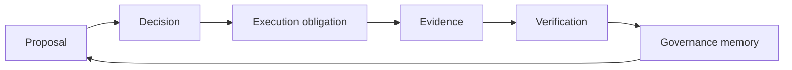

# IsoniaOS Whitepaper

IsoniaOS is a governance control plane for accountable digital organizations. It is built around a simple idea: governance is not only a vote. Governance is a lifecycle that should leave an understandable record.

## The Problem

DAO governance often spans forums, Snapshot, Safe, Governor-compatible tools, block explorers, GitHub, spreadsheets, grant trackers, and community calls. Each tool can be useful, but the full decision trail is hard to reconstruct.

Participants may know that a proposal passed, while still not knowing:

- which policy route applied;
- who reviewed or approved it;
- what action was supposed to happen;
- who became responsible for follow-through;
- whether execution happened;
- what transaction, external record, or manual evidence supports the outcome;
- what should be learned from the result.

This gap weakens accountability and institutional memory.

## Product Thesis

IsoniaOS connects governance decisions to execution evidence and durable records.

```text
governance decision -> execution -> evidence -> verification -> memory
```

The goal is not to replace every governance tool. The goal is to make the lifecycle legible across tools while keeping authority boundaries explicit.

## Accountability Loop

The core loop is:

1. A governance decision is created under a known route.
2. The decision records who approved, vetoed, queued, rejected, or executed it.
3. Execution creates a concrete obligation or result.
4. Evidence is attached, imported, or linked with source labels.
5. Participants can verify which source is authoritative for each claim.
6. The record remains available as governance memory.



## System Model

IsoniaOS is split across focused repositories:

- EVM contracts model onchain governance authority where that authority exists.
- Control Plane indexes events, stores raw records, builds read models, and exposes diagnostics and REST APIs.
- Shared types keep cross-repository DTOs, enums, capabilities, source labels, and trust-boundary shapes compatible.
- SDK provides dependency-light typed API clients and helpers.
- App Core is the self-hostable React/Vite governance console.
- Theme Default provides the default replaceable theme package.
- Integration Lab validates provider assumptions and Sepolia workflows outside product authority.

## Authority And Evidence

Contracts are authoritative only for the onchain state they model. Control Plane read models can explain and cache contract state, but they do not create governance authority. App Core presents and interacts with state; it should not hide authority or imply that an external source overrides contract-modeled state.

External records are evidence or context unless the protocol or a documented product model explicitly grants them authority for a field. Manual accountability notes are annotations. AI output, if added later, is advisory by default.

## Current Product Focus

The current public focus is a developer-preview path for:

- organization setup and activation surfaces;
- proposal route explanation;
- proposal execution identity;
- public archive and decision records;
- accountability records with responsible parties, status, due dates, evidence, and source disclosure;
- diagnostics across contract, indexer, projection, API, config, and UI layers;
- local development flows that use repository-local commands.

## What IsoniaOS Is Not

IsoniaOS is not currently:

- a production operations claim;
- an audited governance security claim;
- a legal or regulatory substitute;
- a complete provider-integration product;
- a token launch product;
- a treasury wallet;
- a voting-only app;
- a replacement for every DAO tool.

ISO token work is separate from these public product docs. Managed-service and commercial planning are also outside this public documentation scope.

## Long-Term Direction

The first market is DAO and Web3 governance because the pain is visible and the evidence surfaces are inspectable. If that path proves useful, the same lifecycle model can later support broader digital organizations, cooperatives, foundations, associations, public-good communities, and carefully scoped civic experiments.

Those later stages require additional legal, compliance, privacy, accessibility, procurement, security, and operational work. They are future directions, not current readiness claims.
